# 寻路系统基础

一个完整的寻路系统至少需要分为**寻航网格构建**和**寻路算法**两个部分，这里我们基于NavMesh原理及部分实践对整套寻路系统进行讲解。


## 寻路算法（参考了redblobgames）

由于构建导航网格十分复杂，这部分留到后面在解读，首先我们关注最为经典的寻路部分，也就是我们已经默认构建完成了网格。

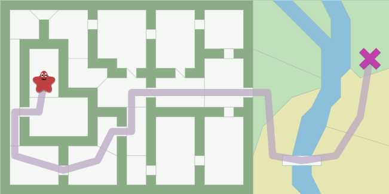

对于寻路算法而言，他的目标就是找到一个点到另一个点的最短路径，在目前的寻路算法中，**BFS是最经典的算法，而A*是使用最多的算法**。

### 1. 算法的输入输出

要解释一个算法，我们最先需要定义的是一个算法的输入输出是什么。

**Input**：寻路算法的输入，通常是数据结构中的图，一个图结构中具备许多顶点和多条边组成。

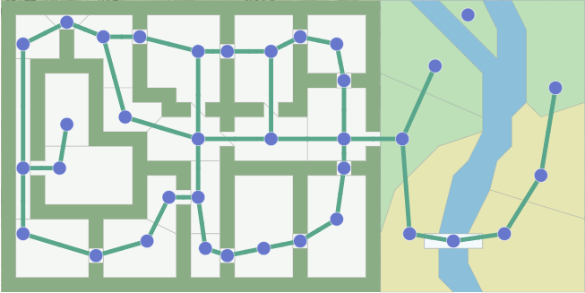

算法其实无需知道原本的地图构造到底是什么样的，算法只会在意输入的图结构是怎样的

**Output**：A*算法找到的路径由图节点和边组成 ，也就是他只会从一点到达另一个点，他并不会给出一个连续的行走路径，而是离散的点的和边。

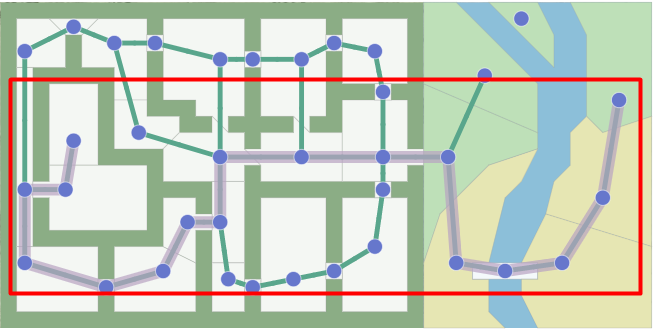

那为了保证算法的绝对精确性，我们通过更细分的划分网格一定能得到更好的寻路结果。

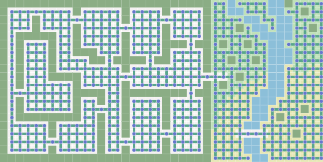

### 2. 广度优先搜索（BFS）

我们使用一种扩展环的思想来设计BFS广度优先搜索算法

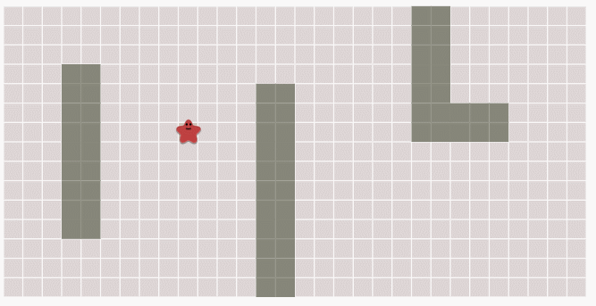

我们可以看到广度优先算法的主要思想就是从星星这边开始逐渐开始向外扩散直至整个网格地图为止。广度优先算法的步骤主要分为两步：

1. 选中当前节点，并寻找所有与该节点邻接的节点
2. 将这些邻接的节点加入序列，若已经被加入则不要重复加入，将当前节点移出序列

算法一致持续至空间内所有节点网格全部被覆盖（已访问）为止。

```c#
//伪代码

//[初始点] 加入到队列中
//while语句：判断队列是否为空
	//第一个元素（一处队列）：设置为当前节点V
	//判断节点V是否是[目标点]
		//如果是，中止遍历算法
		//如果不是，遍历节点V相邻的子节点，并将他的子节点加入队列中
	//移除搜索完成的节点V，并将节点V标记为[已搜索]
```

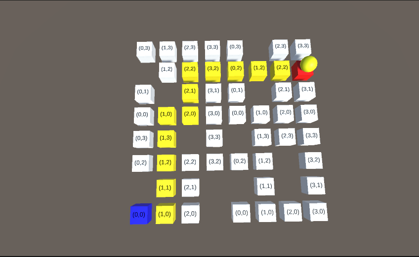

通过算法我们可以得到一个网格系统下的最短路径，当然BFS算法并没有记录网格到网格之间的权重，也就是无权图，我们这里可以理解为从出发格到结束格，BFS算法得到的路径格子总数一定是最少的。

这使得BFS算法在塔防游戏，SLG等网格化地图寻路中有较好的表现，但在实际大规模的3d场景寻路中仅仅BFS还远远不够。

### 3. Dijkstra算法

在上方的问题中，我们认为格子之间的移动消耗相同的成本（无权图），但实际的应用中，格子之间是存在不同的步数消耗的（有权图），当这些格子中存在权重时，BFS算法将失效，此时我们得采用Dijkstra算法。

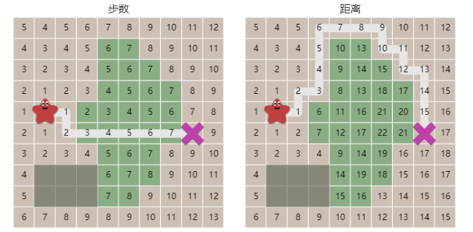

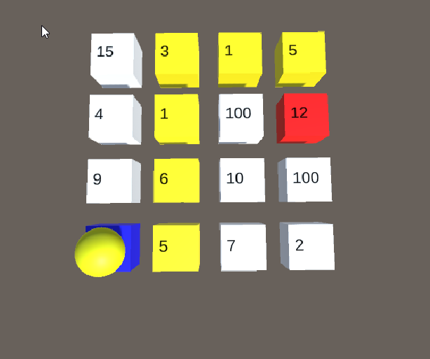

迪杰斯特拉算法会优先选择路径权值最小的路径，从伪代码上与BFS高度相似，来看一下

```C#
//伪代码

//[初始点] 加入到队列中
//while语句：判断队列是否为空
	//第一个元素（一处队列）：设置为当前节点V
	//判断节点V是否是[目标点]
		//如果是，中止遍历算法
		//如果不是，遍历节点V相邻的子节点，并将他的子节点加入队列中
			//foreach 遍历所有子节点C
				//记录当前的cost_current=V(cost_so_far)+C_cost
				//如果cost_current<=C(cost_so_far)
				//则替换C(cost_so_far),且替换C的前一个节点from
	//移除搜索完成的节点V，并将节点V标记为[已搜索]
	//将当前队列内所有节点按照cost_so_far值从小到大排序
```

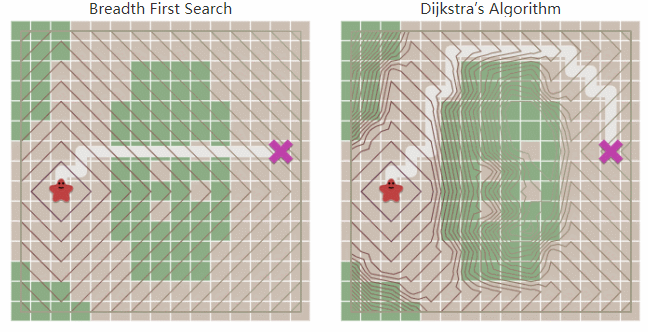

使用优先级队列(队列排序)改变了边界扩展的方式，但能更准确的获得带权图的最短路径值。

### 4. 启发式搜索

使用广度优先搜索和 Dijkstra 算法，边界向四面八方扩展。如果您试图找到通往所有位置或多个位置的路径，这是一个合理的选择。然而，一种常见的情况是只找到一条通往一个位置的路径。让我们使边界向目标扩展而不是向其他方向扩展。首先，我们将定义一个**启发式函数**，它告诉我们离目标有多近：

方格网络上的曼哈顿距离：abs(ax-bx)+abs(ay-by)

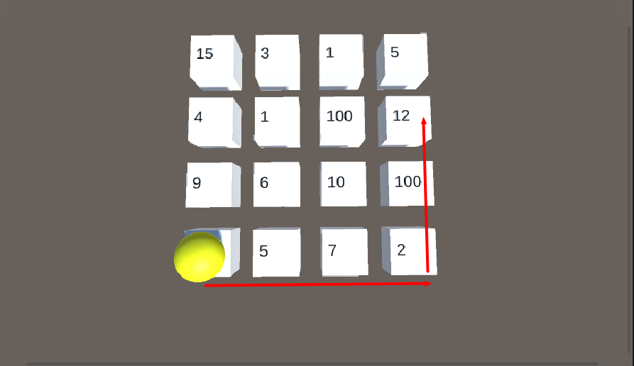

如图起点到终点的曼哈顿距离就是5。

启发式算法比较简单，他与**迪杰斯特拉算法算法最大的不同在于他不采用cost_so_far值对队列进行排序，它使用曼哈顿值对队列进行排序**。

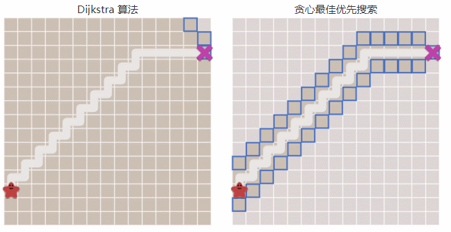

**以上两张图充分说明了启发式算法在扩展上的速度是优于Dijkstra算法的，但问题在于他没有严格使用cost_so_far值，因此在遇到障碍时会出现结果并不是最短路径**。

### <font color=red>5. A*算法</font>

在完整了解上述的算法后，A* 算法也称不上复杂了。Dijkstra 算法可以很好地找到最短路径，但它会浪费时间探索没有希望的方向。Greedy Best First Search 探索了有希望的方向，但它可能找不到最短路径。A* 算法从一开始的实际距离和目标的估计距离。

**Dijkstra 算法计算与起点的距离cost_so_far。Greedy Best-First Search 估计到目标点的距离。A* 使用这两个距离的总和进行排序。**

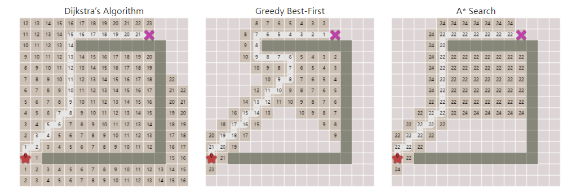

A* 是两全其美的。只要启发式不高估距离，A* 就会找到最佳路径，就像 Dijkstra 算法那样。A* 使用启发式对节点重新排序，更快地遇到目标节点。

我们在选择预估函数的时候，预估函数需要满足这一个条件：h(x) ≤ d(x, y) + h(y) 对于任意的图中的边 d(x, y), h代表视频中提到的预估代价，d在这里代表图中的边的长度。（被称之为单调“monotone”）。不过对于视频中提到的欧拉距离和曼哈顿距离，它们都满足这个条件。

**A*往往只能的出一条最短路径，但A\*算法的最大好处时可以通过调整估值函数来减少寻路算法的遍历次数**


## Unity Navmesh 使用

### 基本寻路移动

unity的navmesh高级寻路组件是一套非常强大的寻路组件，他的生成原理是基于RecastNavigation，原理相关内容请看**寻路系统进阶——NavMesh原理.md**。

我们首先定义一个场景以及一个空物体，并给空物体赋予一个**NavmeshSurface用于烘焙。**

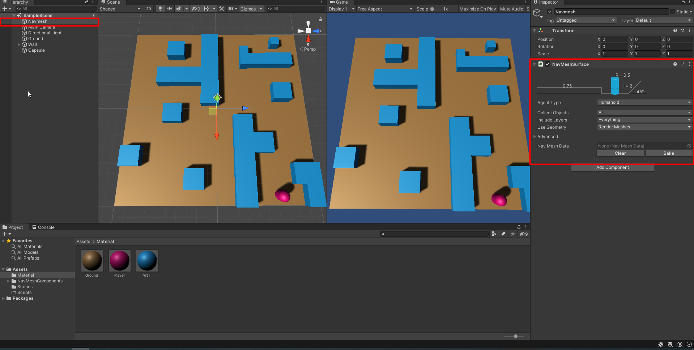

同时我们还可以设置物体的层级来选择是否对当前物体进行烘焙，**若我们取消Player层，Player这个胶囊体就不会对产生导航路径形成障碍**，同时我们看到在Use Geometry这一项中有根据render meshes进行烘焙，同时也可以针对collider进行烘焙。

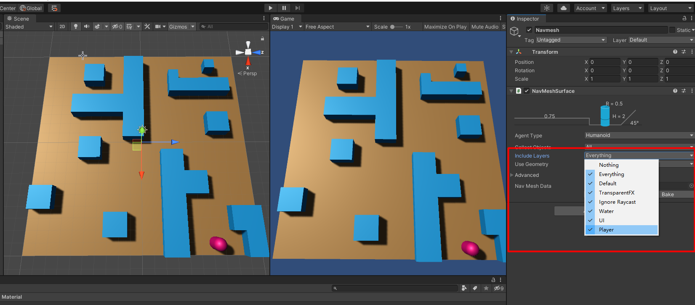

同时我们对Wall添加navmesh modifier，override区域中勾选not walkable，可以再烘焙时考虑到墙壁的阻碍而进行正确的烘焙。最终结果如下：

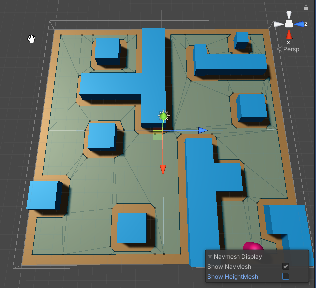

烘焙完成后，在Player上挂载Navmesh Agent，现在只需要在Move脚本中使用NavmeshAgent.setDestination()，Agent会根据最短路径将player移动至指定位置。

**我们可以看到，navmesh的网格是根据顶点来生成的，网格大小不同，在我的理解中，网格的区域面积越大，通过该网格的代价也就越大，最终也能演化成一个求带权图最短路径的问题。**

### 动态生成寻路网络

以上所有的操作均是我们事先设置好了墙壁的路径且完成NavmeshSurface的生成后，player才可以正常寻路，那么如下两种动态情况以上内容就无法满足：

1. **随机生成Wall（地图）**
2. **场景中的物件会发生变化（消失，移动，生成）**

针对问题1，我们需要引入NavmeshSurface，并在所有随机地图生成后，在进行构建。代码如下

```C#
NavMeshSurface navmeshsurface
void Start(){
	RandomMapGenerate();
	navmeshsurface.build();
}
```

针对问题2，我们需要先引入一个新的组件——**navmesh obstacle**

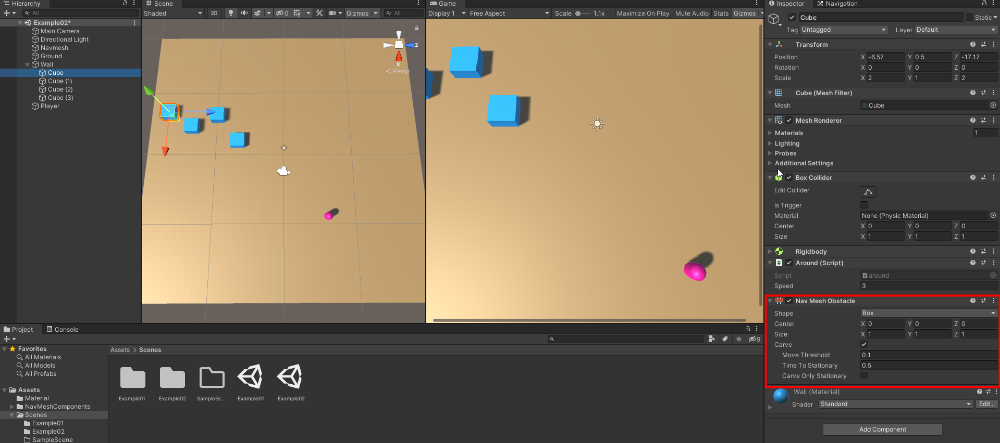

我们**勾选上Carve，意味着navmesh的网格会根据obstacle的移动动态生成网格和最短路径，若不勾选，则会根据navmesh agent的obstacle碰撞避免尽可能去规划路径（预计是射线检测）**

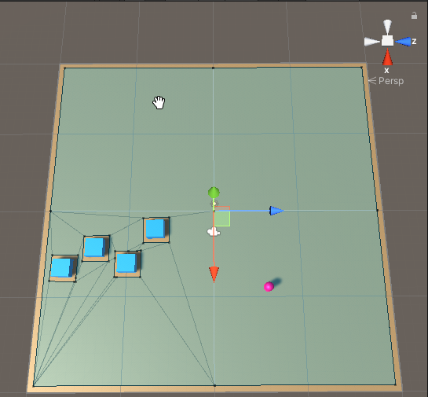

**我们现在可以看到随着这四个物件的移动，顶点网格将会自动生成，同时我认为网格的生成仍然遵循四叉树和八叉树的优化算法，这里我们可以看到左上右上右下三块区域的网格没有发生变化**。

### 网格连接

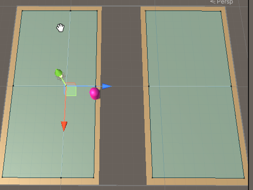

我们时常会遇到这样的平台路径，这样的分割网络Navmesh的寻路是无法到达的，这里我们使用navmeshlink将两个网格连接在一起。

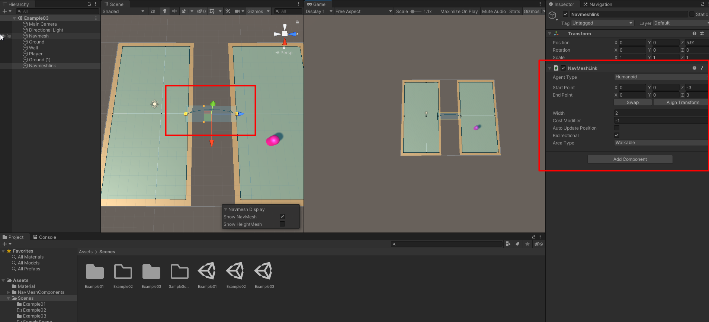

**在我们的实际应用中，需要角色的动画等等信息，我们均可以通过NavMeshAgent去获取想要的参数，包括当前速度desiredspeed，剩余距离，停止距离等等来触发我们想要的动画效果。**

