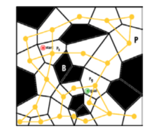
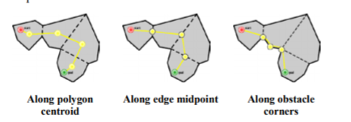
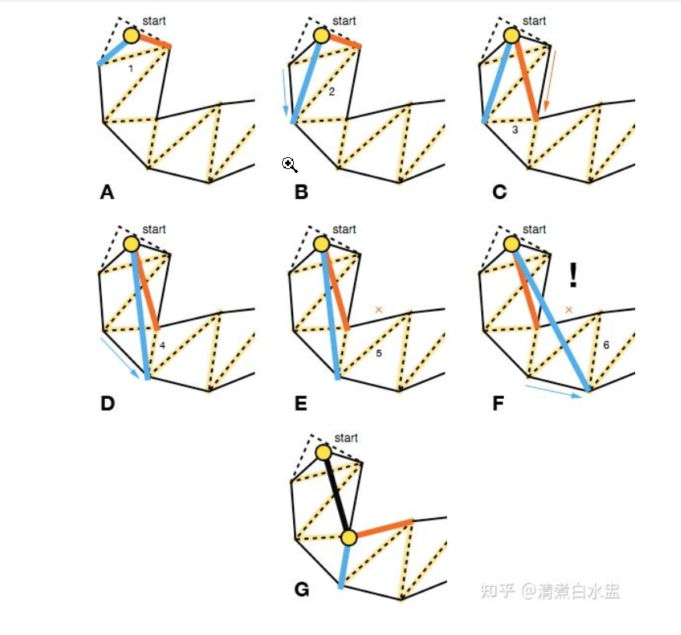
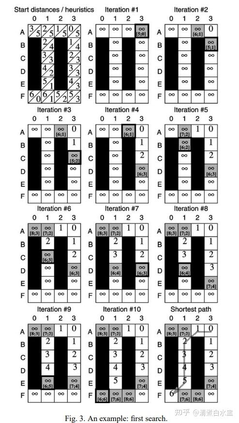
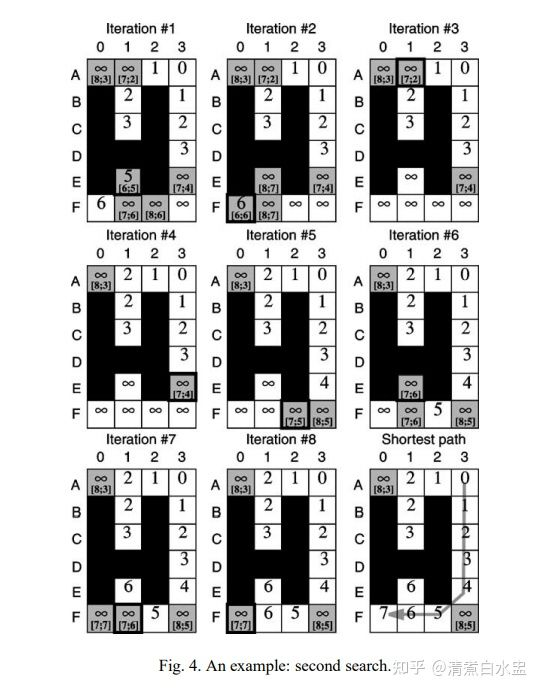

# 寻路系统进阶——NavMesh原理

NavMesh是一种基于凸多边形网格的寻路，其整个寻路流程至少分为两个部分，**导航网格构建**和**寻路算法**。

## 寻航网格构建（太难了，了解即可啦）

寻航网格的构建非常复杂，大体流程如下所示：

1. **体素化**
2. **生成地区**
3. **生成轮廓**
4. **生成多边形网格**
5. **生成高度细节**

### 体素化(Voxelization)

核心类：Heightfield

在体素化阶段，源几何体被转换成高度场，用来表示不可行走的空间。一些不可走的表面在这个阶段会被剔除掉。

对于源几何体上的每个三角形，使用“保守体素化算法”（Conservative Voxelization）分割成体素，并加入到高度场中。保守体素化算法确保了每个三角形面，都会被生成的体素完全包围。

体素化阶段后，实心高度场(solid heightfield)包含了很多的区间(span)，覆盖了源几何体上的所有面。

### 生成地区(Region Generation)

核心类：CompactHeightfield

这一阶段的目标是，近一步定义实体表面上哪部分是可以行走的，以及将这些可行走的部分划分成连续的地区，这些地区可以最终构成简单多边形。

首先，将实心的高度场，转换成一个开放的高度场(open heightfield)，用来表示实体表面上那些可以行走的部分。一个开放的高度场，表示位于实体空间表面的地表部分。

在下图中，绿色部分代表开放区间(span)中的地表。这相当于是实心高度场上所有可行走的上表面。注意那些墙，桌子下面的区域，以及走廊扶手上那些比较窄的区域，已经在实心高度场生成的时候被剔除掉了。一些不可行走的区域，比如桌面，楼梯扶手，墙边较窄的位置，目前仍然显示为可行走的。

然后，进一步剔除掉不可行走的区域。在计算完成的时候，开放区间中那些认为可以行走的部分，应该通过下面的测试：
\+ 该区域不能紧挨着障碍物(如，墙，家具等)（使用WalkableRadius作为距离阀值）
\+ 该区域在表面之上没有足够的开放空间(非碰撞区域)。（人在不碰撞到其他物体的情况下，能够合法的移动）(使用WalkableHeight作为高度阀值)

为剩下的所有区间生成邻接信息，用于把他们合并成一个大的面片。该算法使用一个最大垂直步长(WalkableStep)来决定哪些区间是可以连在一起的。这允许一些特殊的结构能够被考虑进来，比如楼梯，路边，桌面等。例如，构成阶梯的区间能够当做邻居被连接在一起，而桌面上的区间就不能和地板连接在一起。

下图显示的是地区。注意看阶梯上的那些地区，尽管构成的区间并没有直接相连。也需要注意那些桌子上，楼梯扶手，以及所有其他实心高度场上不可走的面，在这个阶段后已经被成功剔除了(黑色表示被剔除的区间)。

在该阶段后，这些相连的地区代表了可行走的面。

### 生成轮廓(Contour Generation)

核心类：ContourSet

轮廓就是沿着地区边缘“行走”，构成简单多边形。这是从体素空间转换回向量空间的第一步处理。

首先，从地区生成非常精细的多边形。

然后，使用多种算法来完成下面的步骤：
\+ 简化相邻多边形的边缘（地区之间的部分）
\+ 简化边界(边界是没有邻接或邻接了障碍物的轮廓)(EdgeMaxDeviation)
\+ 优化边界的长度。（边界如果太长，不能得到最优的三角形）

下图展示了执行此算法后的轮廓

在该阶段结尾，简单多边形代表了可行走的表面。

### 生成凸多边形(Convex Polygon Generation)

核心类：PolyMesh

许多算法只能用于凸多边形。因此，这一步需要把轮廓构成的简单多边形转换成凸多边形网格。

> 注意：许多寻路算法都使用这个网格

下图中，你可以看到由轮廓形成的凸多边形。

在该阶段的结尾，一个凸多边形网格代表了可以行走的表面。

### 生成高度细节(Height Detail Generation)

核心类：PolyMeshDetail

在这最后的阶段，凸多边形网格会被Delaunay三角化算法三角化，于是可以增加高度的细节。在多边形的内部或者边缘添加顶点，来确保网格与原始几何体表面等价。(DetailSampleDistance和DetailMaxDeviation)

> 注意：从技术上讲，这一步是可缺省的。细节网格在寻路中不是必须的，但是存在细节网格的情况下，某些查询会返回更加精确的数据。

## Navmesh的寻路算法

### 最简单的A*实现（中心地标）

在我们完成网格化后，先不考虑特别复杂的情形，我们可以认为当前的寻路如下图所示。

我们只从一个地块的中心去往另一个中心，那么我们现在要从红色走向绿色，应用寻路算法A\*即可。这里我们可以使用两点之间的欧拉距离作为A*算法的约束函数，也就是他将红色到任意点的cost_so_far也就是**经过的黄线距离之和G**与**红绿两点间距离之和H**，相加得到**F=G+H**，**根据F值进行排序**，进入优先级队列即可。

得到路径后，我们可以做一些简化，比如随着邻边的边缘来走可以得到距离更短的路径（**看漏斗算法**）。

### 三角形地块优化（漏斗算法）

首先，我们还是要将A*算法得到路径的所有网格提取出来，排除掉所有邻接两个网格的边，由起始点开始向两个最近的交点连接，并得出角度。

明白算法的几个原则：

1. **依次挪动两条线，挪动的点是朝目标的下一个点**
2. **每次两条线的挪动若能使夹角变小，便可以挪动，若变大则换另一条线挪动**
3. **若出现两条线的夹角为“负”（左右反向），路径合并，重新规划出新的两条线**
4. **重复以上过程直至到目标点为止**

### 动态寻路算法（LPA\*，D\*Lite）

这是一个最普通的A\*算法（A3--->F0），在最开始时我们默认所有的方格均是无穷大，也就是我们根本未知G,H值，随着A*算法的进行我们逐渐填上G,H值根据A\*优先队列的寻路最后得到最短路径，当然也有一部分区域是不会进入优先队列的，因此一直是无穷大。

我们此时在D1点突然出现了一个障碍物，那该怎么办呢？

LPA\*算法将会比较D1点连通方格的**G值和rhs值（向前看一步的值）**

D1点所有连通点有C1,E1

先来看C1：rhs(C1) = G(B1)+distance(B1,C1) = 3           **rhs(C1)=G(C1)  不作处理**

再来看E1：rhs(E1)=G(F1)+distance(E1,F1) = 7               **rhs(E1)!=G(E1) 将E1的G值标记为无穷**

一旦某点要被处理，那连通点也要处理，E1附近的F0,F1,F2继续处理

最后我们看到在第五次迭代后，动态加入的障碍连通点处理完毕，之前寻路的一部分G值信息被保留，重新从E3点继续开始寻路。

**总结：动态寻路的核心是尽可能地利用先前计算得到的G值（cost_so_far）**
