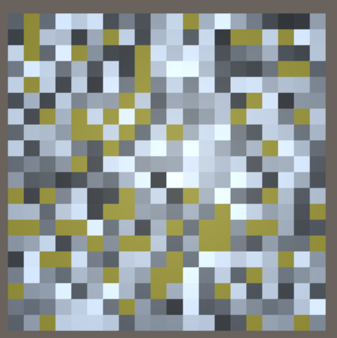
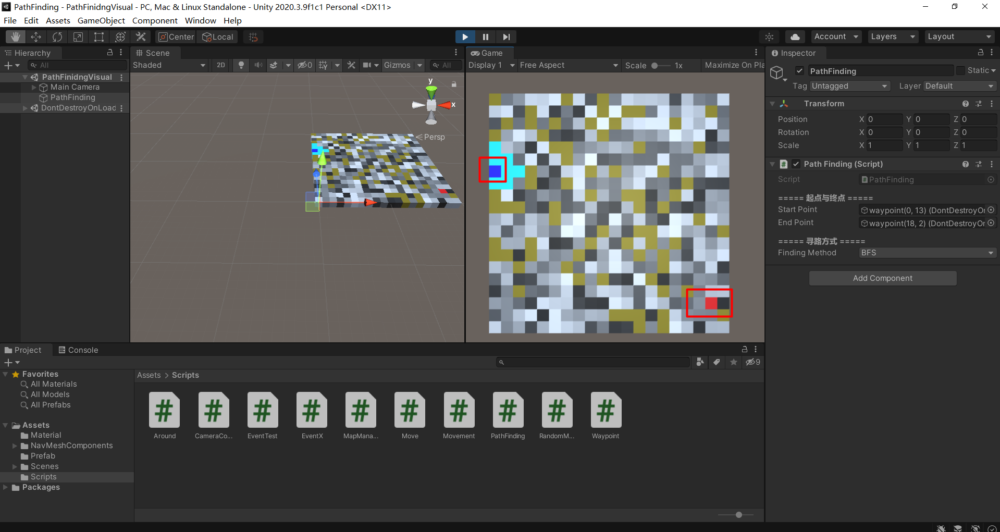
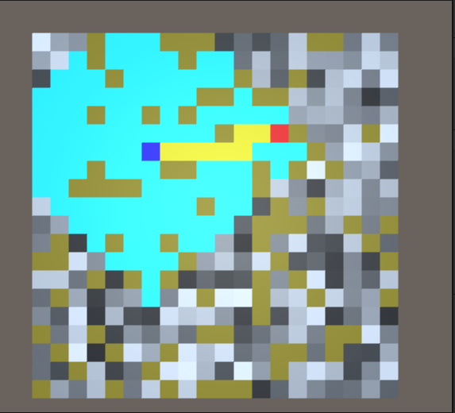
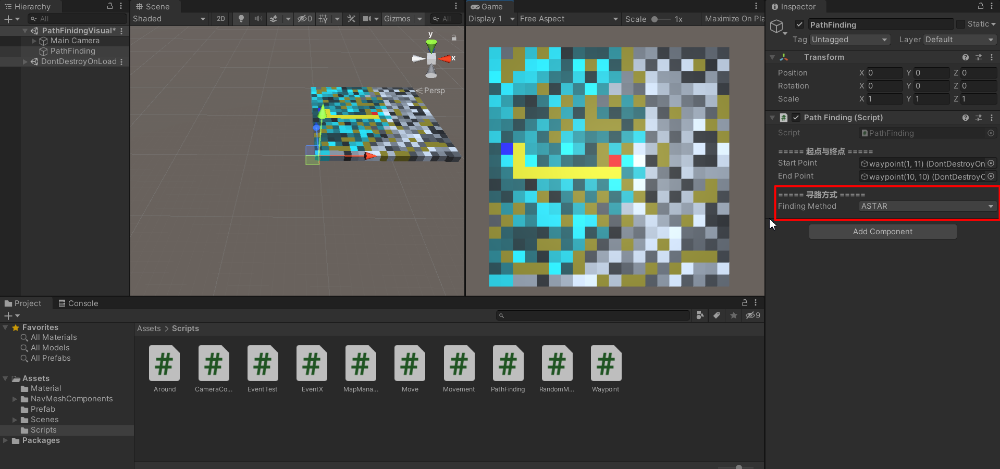
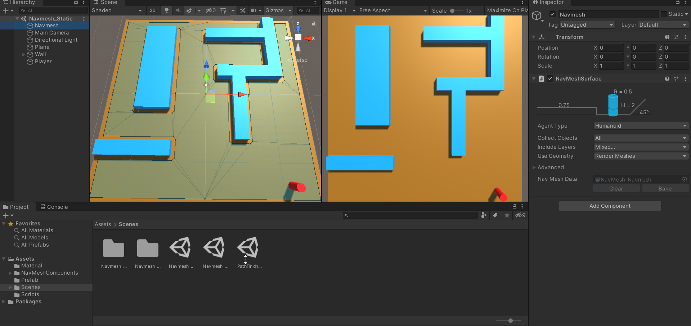
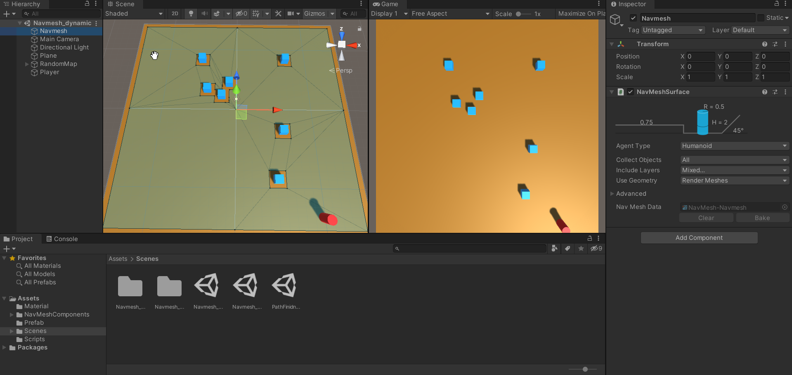

# 寻路算法可视化与Navmesh实践

本项目主要参照了[*Red Blob Games*](https://www.redblobgames.com/)相关寻路算法的文章，以及借鉴了[BeaverJoe的广度优先搜索](https://www.bilibili.com/video/BV1X54y1D7Z4)


## 寻路算法可视化

我们的主要目标是要完成BFS,Dijkstra,A*算法，以及他们的可视化。

### 地图生成

地图的生成我主要是根据行列生成多个Cube，每一个Cube的坐标值标准化得到一个Vector2Int值，并用字典类记录WayPointDic\<Vector2Int,Waypoint\>,其实主要目的就是完成了邻接矩阵，以及矩阵中每一个节点与其GameObject的对应关系。我这里还要使用cost来指出通过该节点的消耗,并根据颜色深浅来区分，同时在初始化的过程中会随机对一些Cube赋予isBrick布尔值，使其变为一堵墙，寻路算法不可通过。



灰色颜色区域的都是可通过的路径，黄色为墙，灰色区域颜色越深代表cost越大。

### 数据结构

这里分享一下Waypoint图节点的数据结构

```C#
public class Waypoint{
	public bool isExplored = false;    //是否被访问
    public bool isBrick = false;	   //是否是墙
    public Waypoint from;              //访问他的前一个节点
    public int cost;				   //通过该点的消耗
    public int cost_so_far;            //寻路算法中已经累计的消耗
    public int distance;			   //A*算法中 累计消耗+曼哈顿距离
    public Vector2Int vector2Int;	   //保存该GameObject的Vector2Int值
}
```

### 算法逻辑

这里并不过多的赘述BFS,Dijkstra,A*的实现方法，具体请见Document中的**寻路系统基础.md**。

这里逻辑主要是我们通过鼠标的射线检测获取起始点和终点，在得到两点后我们开始执行寻路算法。



我们的遍历方向是上右下左，这里是通过Vector2Int自带的函数实现

```c#
private Vector2Int[] directions = { Vector2Int.up, Vector2Int.right, Vector2Int.down, Vector2Int.left };
//对应的就是(0,1);(1,0);(0,-1);(-1,0)
```

得到路径后通过不停的寻找节点的from来取得path列表如下所示：

```C#
 Waypoint prePoint = endPoint.GetComponent<Waypoint>().from;
 while (prePoint != startPoint.GetComponent<Waypoint>()) {
     prePoint.GetComponent<MeshRenderer>().material.color = Color.yellow;
     prePoint = prePoint.from;
 }
```

则得到路径后会通过黄色高亮出最短路径。



当使用Dijkstra，A*带有cost值得算法时，路径会根据cost值有深浅的变化，更明显地看出最短路径。



### 可视化

要做到寻路算法可视化的方式是要使用unity中的协程函数，而在我们实际的寻路使用中，也可以启动多个协程用于执行不同单位的寻路策略。Unity是单线程的，协程就是在单线程下的一种更轻量的线程，我们可以通过Coroutine创建对象的方式创建协程，也可以通过StartCoroutine(函数)的方式直接调用协程。协程往往会在Start()生命周期中被创建，并开始执行协程，在协程执行的函数体中，我们用yield来控制协程的执行频率，yield return的生命周期在Update()之后。

**例：**当有开始结束点后开始执行协程，每一秒执行一次，路径搜索完成后停止协程。

```c#
private Coroutine findASTAR; //定义协程
void Start(){
	findASTAR = StartCoroutine(ASTARFinding()); //开启协程
}
//协程函数的签名是一个迭代器，事实上我们应该可以通过协程池来控制协程的执行
 IEnumerator ASTARFinding(){
 	  //这里notNull是一个Func委托，返回bool值 我们设计函数当开始结束点不为空时开始执行协程
      yield return new WaitUntil(notNull); 
       //将起始点加入队列
        queue.Enqueue(startPoint.GetComponent<Waypoint>());
        //当队列不为空时开始处理每一个节点
        while (queue.Count > 0)
        {
            //节点出队
            var current_waypoint = queue.Dequeue();
            //若当前节点就是最终的endpoint结束循环
            if (current_waypoint == endPoint.GetComponent<Waypoint>())
            {
                isFinished = true;
                //终止协程
                StopCoroutine(findASTAR);
                break;
            }
            else
            {
                //查找当前节点上下左右的四个节点
                ExploreAround(current_waypoint);
                //将当前节点设置为已访问（isExplored）
                current_waypoint.isExplored = true;
            }
            sortQueue();
            //每0.1秒执行一次协程
            yield return new WaitForSeconds(0.1f);
        }
 
 }
```


## Navmesh实践

### 静态navmesh生成

通过静态的navmeshSurface对已有的物件根据mesh进行烘焙，通过modifier进行烘焙得到区域。



### 动态navmesh生成

通过添加navmeshObstacle组件对动态生成的障碍物进行实时的烘焙，如图中的cube均由随机算法生成。



